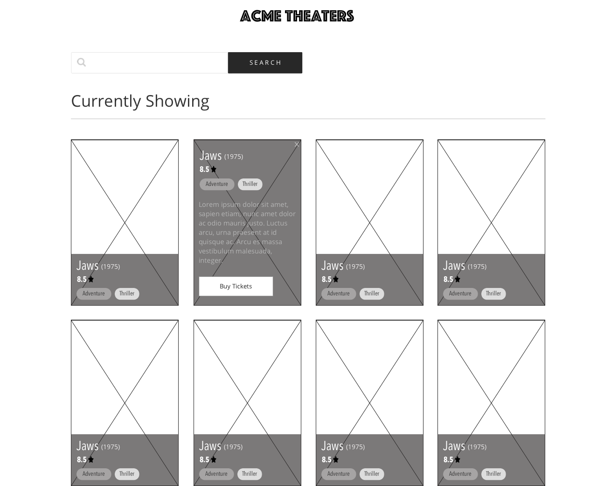

# PatientIQ Frontend Engineering Challenge
Welcome! We’re glad you’re considering joining the PatientIQ team! This is a universal exercise for all frontend engineering candidates at Patient IQ. Your submission should showcase your capabilities. We encourage you to be creative and play to your strengths.

The purpose of this exercise is to form the basis for our next discussion. There is no objective measurement for pass/fail. Every code submission will be followed with a code review so we can ask you about your design choices as well as learn from your experience. The idea is to get a sense of what it would be like to be a member of our team and learn more about each other. The following exercise consists of a wireframed design and user stories that simulate a real world application. It will be your goal to provide an implementation for this design.

While some user stories are required, feel free to be creative with the design, and use your best judgement on anything else that is not well defined. We will not provide additional assistance once you begin the exercise to be fair to all candidates.

Please do not to share your solution online.

We ask people to complete the assignment within 72 hours, but respectfully understand you may have other commitments. Please take as much time as you need.

We also ask you to spend about 2 - 4 hours on this exercise, with a maximum of 6 hours permitted. The time limit is there to ensure we evaluate candidates equitably.

Good Luck!

## Welcome to Acme Theaters
Acme Theaters has come under new ownership and is looking to refresh their website to compete with other local theaters. The owners want to make it as easy as possible for theater goers to visit the site from any device, and be able to learn more about the movies that are currently playing. They've hired you to implement the given design, but use your creativity to make it your own.

### User Stories
Below you'll find the user stories that are shown in the design, along with a few that could be added if you have time.

#### Required
- As a User, I should be able to see all currently showing movies.
- As a User, I should be able to click a movie to see more details.
- As a User, I should be able to search for a movie by name.
- As a User, I should be able to scroll vertically to see all of the movies available.
- As a User, I should be able to access the site with assistive devices.
#### Optional
- As a User, I want to be able to view the site on mobile devices.
- As a User, I want to be able to filter one or more genres.
- As a User, I want to be able to save a movie to my favorites.
- As a User, I want to be able to sort movies by rating.

# Getting Started
Install dependencies via `yarn install`. You're welcome to install any packages that you think might help speed up your development process.

Your movie data can come from anywhere, including a local json file, but we strongly recommend using [https://developers.themoviedb.org/3/getting-started/introduction](https://developers.themoviedb.org/3/getting-started/introduction). It's preferred to create your own api key, but you may use the provided key through use of the `decodedApiKey` function.

An example test and the ability to run that test is provided, although it's not required to include tests as part of your implementation.

## Available Scripts

In the project directory, you can run:

### `yarn start`

Runs the app in the development mode.\
Open [http://localhost:3000](http://localhost:3000) to view it in your browser.

The page will reload when you make changes.\
You may also see any lint errors in the console.

### `yarn test`

Launches the test runner in the interactive watch mode.\
See the section about [running tests](https://facebook.github.io/create-react-app/docs/running-tests) for more information.

## Learn More

If you are unfamiliar with React you can check out the [React documentation](https://reactjs.org/) to learn more.
